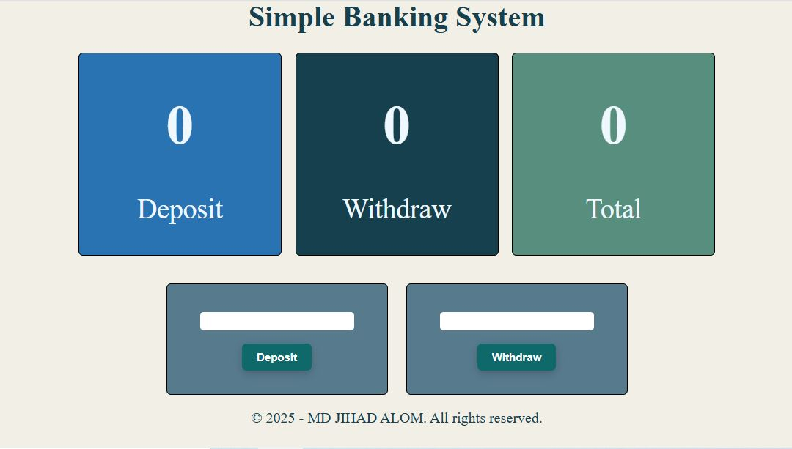
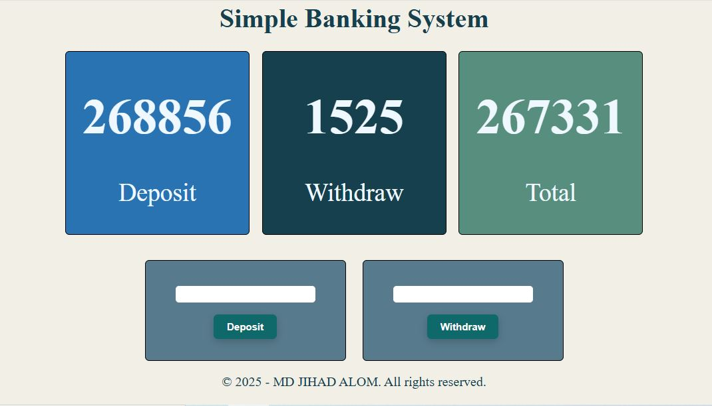

## Simple Banking System
<p align="center">
  
</p>

A simple banking system built with **HTML, CSS, and JavaScript**.  
Users can deposit, withdraw, and view all amount related data.

🔗 **Live Demo:** 👉 [View Here](https://mdjihadalom.github.io/Simple-Banking-System-Using-DOM/)

---

## 📸 Screenshots




---

## 🚀 Features

✅ Deposit money  
✅ Withdraw money  
✅ View all amount related data  
✅ Prevents invalid transactions – Users cannot deposit or withdraw negative or null values; an alert message is displayed.    
✅ User-friendly interface    

---

## 🛠️ Technologies Used

- **HTML** - Structure of the application  
- **CSS** - Styling the UI  
- **JavaScript (DOM Manipulation)** - Handling transactions  

---

## 📥 Installation Guide

1. Clone the repository:
   ```bash
   git clone https://github.com/mdjihadalom/Simple-Banking-System-Using-DOM.git

## 📌 Usage

1. Enter an amount and click **Deposit** to add money.  
2. Enter an amount and click **Withdraw** to remove money.  
3. View the updated balance and transactions.  

---

## 🤝 Contributing

1. Fork the project  
2. Create a new branch (`git checkout -b feature-branch`)  
3. Commit your changes (`git commit -m "Added new feature"`)  
4. Push to the branch (`git push origin feature-branch`)  
5. Open a Pull Request  

---

## 📜 License

This project is **free to use** and does not require a license.  

---