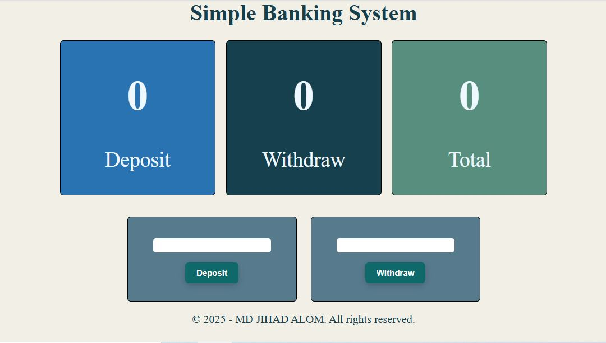

# 🏦 Simple Banking System
# 

A simple banking system built with **HTML, CSS, and JavaScript**.  
Users can deposit, withdraw, and view all amount related data.

🔗 **Live Demo:** [View Here](https://mdjihadalom.github.io/Simple-Banking-System-Using-DOM/)

---

## 📸 Screenshots




---

## 🚀 Features

✅ Deposit money  
✅ Withdraw money  
✅ View all amount related data  
✅ User-friendly interface  
✅ User-friendly interface  

---

## 🛠️ Technologies Used

- **HTML** - Structure of the application  
- **CSS** - Styling the UI  
- **JavaScript (DOM Manipulation)** - Handling transactions  

---

## 📥 Installation Guide

1. Clone the repository:
   ```bash
   git clone https://github.com/your-username/simple-banking-system.git
